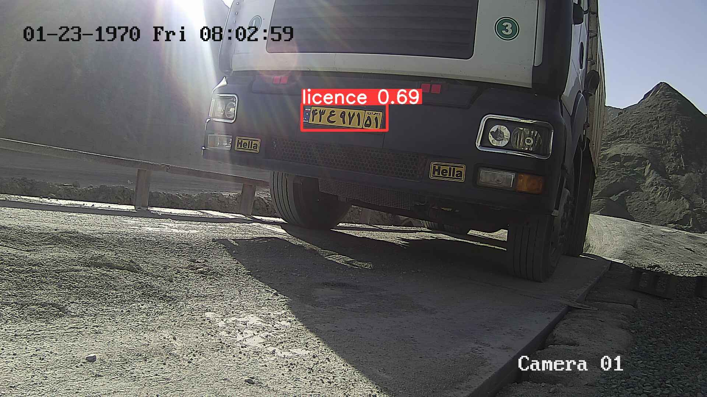

# ANPR-YOLOv8

# Results

<!DOCTYPE html>
<html lang="en">
<head>
  <meta charset="UTF-8">
  <meta name="viewport" content="width=device-width, initial-scale=1.0">
  <style>
    table {
      width: 100%;
      border-collapse: collapse;
      margin-top: 20px;
    }

    table, th, td {
      border: 1px solid #ddd;
    }

    th, td {
      padding: 8px;
      text-align: center;
    }

    img {
      max-width: 100%;
      height: auto;
    }
  </style>
</head>
<body>

<table>
  <tr>
    <td></td>
    <td></td>
  </tr>
 
</table>

</body>
</html>


# How to use:
1- create a virtual environment:
```
python -m venv env
```
2- Activate it:
```
env\Scripts\activate
```

4- install ultralytics:
```
pip install ultralytics
```

5- install pytorch with cuda support:

```
pip install torch --upgrade torchvision torchaudio --index-url https://download.pytorch.org/whl/cu118
```

6- Train the model
```
yolo task=detect mode=train epochs=50 data='dataset\yolov8\data.yaml' model=yolov8m.pt imgsz=300 batch=2 
```

7- Test the model
```
yolo task=detect mode=predict model="runs/detect/train/weights/best.pt" save=True conf=0.3 source='dataset/yolov8/test/images/'
```