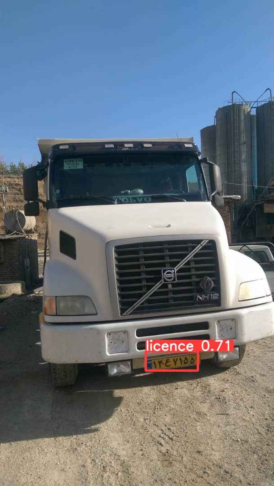
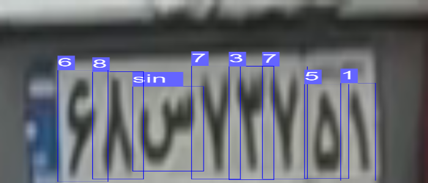
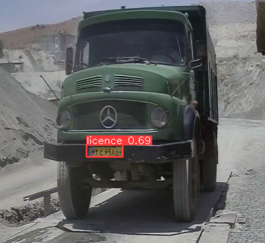

# ANPR-YOLOv8
### Automatic number plate recognition (Iranian)

### سامانه تشخیص پلاک ایرانی

# Results

| image 1 | image 2 |
|----------|----------|
|||

# Dataset
You can download the dataset from my roboflow profile:
https://universe.roboflow.com/barzansaeedpour/anpr-iranian-2

You can also use the code in (download_dataset.py) to download it. 

# How to use
1- create a virtual environment:
```
python -m venv env
```
2- Activate it:
```
env\Scripts\activate
```

4- install ultralytics:
```
pip install ultralytics
```

5- install pytorch with cuda support:

```
pip install torch --upgrade torchvision torchaudio --index-url https://download.pytorch.org/whl/cu118
```

6- Train the model
```
yolo task=detect mode=train epochs=50 data='dataset/data.yaml' model=yolov8m.pt imgsz=300 batch=2 
```

7- Test the model
```
yolo task=detect mode=predict model="runs/detect/train/weights/best.pt" save=True conf=0.3 source='dataset/test/images/'
```

# Detection results (نمونه تشخیص)

|  |  |
|----------|----------|
|||
|||

# Truck scale results (نمونه تشخیص در باسکول)

|  |  |
|----------|----------|
|||
|||
